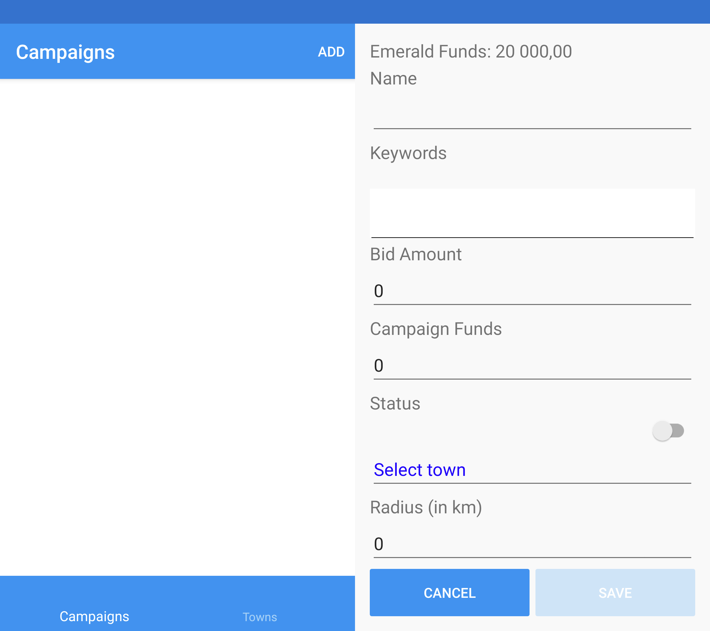
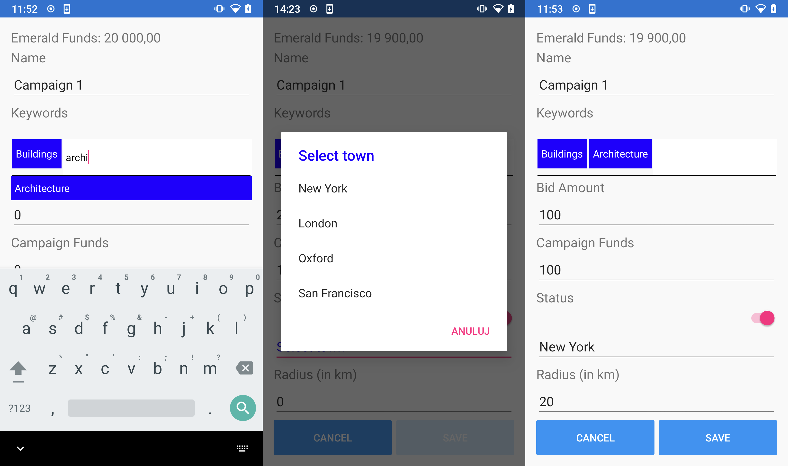
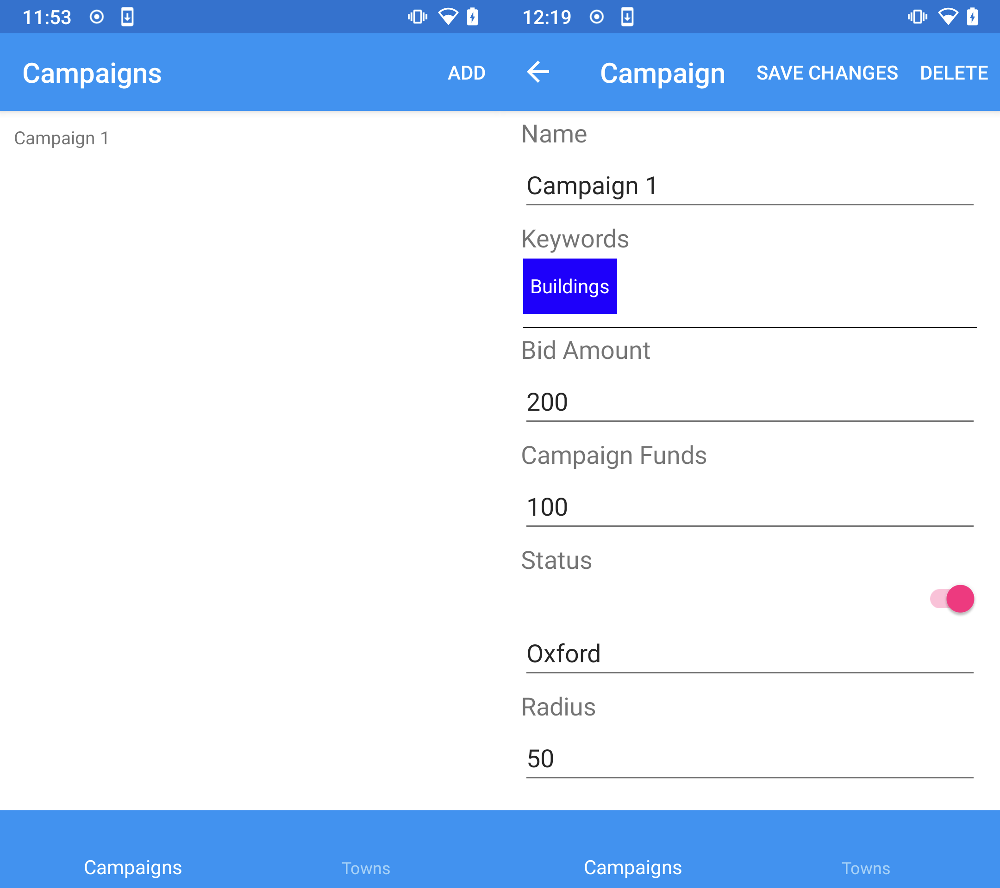
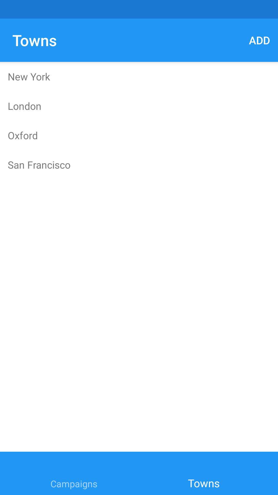

# CampaignPlanner
Campaign Planner is a simple project that executes [CRUD](https://en.wikipedia.org/wiki/Create,_read,_update_and_delete) operations on a campaign object. Project uses [MVVM Pattern](https://docs.microsoft.com/en-us/xamarin/xamarin-forms/enterprise-application-patterns/mvvm).

Project is developed using real Android device, not tested on iOS.

Campaign uses few different controls to achieve this goal: Picker for selecting Town, Switch for managing status, [AutoCompleteTextView](https://github.com/cemozguraA/Xamarin.RisePlugin.AutoCompleteTextView) for working with Keywords, and few Entries for dealing with text and numbers.

Different controls

And finally saved Campaign and Edit action

Working with Towns is similar to working with Campaigns

# What's next

* Adding CRUD actions to Keywords
* Merging New and Edit views into one
* Better validation with [Behaviors](https://docs.microsoft.com/en-us/xamarin/xamarin-forms/app-fundamentals/behaviors/)
* Adding more unit tests
* Adding UI tests with [Xamarin.UITest](https://docs.microsoft.com/en-us/appcenter/test-cloud/frameworks/uitest/xamarin-forms?tabs=windows)
